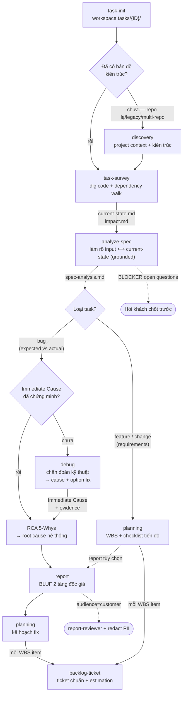

# task-toolkit — Package Usage Guide

README này dành cho người dùng/người bảo trì đọc để hiểu cách dùng package. Nó **không** phải một phần của runtime workflow — skill không load file này khi chạy.

Mục tiêu: một **lifecycle giao việc** từ 1 title/spec → khảo sát code → phân tích spec → kế hoạch (WBS) → report → backlog ticket + estimation. Evidence-first, kết-luận-trước, 2 tầng độc giả (non-tech + dev), đa ngôn ngữ VN/EN/JA (mặc định VN), xuất md/docx/pdf/xlsx. **Mỗi stage tái dùng artifact stage trước, không điều tra lại.**

Package **tự chứa đầy đủ** — không phụ thuộc plugin/skill nào bên ngoài.

## Entrypoint chính: `/task-toolkit:report` (orchestrator; các skill gọi lẻ được)

> Chưa biết dùng thì gõ **`/task-toolkit:help`** — in bản đồ đầy đủ, không chạy gì.
>
> Tên lệnh **giống nhau ở Claude Code và Codex**. `install.sh` đặt lối tắt Codex đúng dạng `task-toolkit:<skill>` cho khớp.

```
/task-toolkit:report <title|mô tả> [locale=vn|en|ja] [audience=internal|customer]
/task-toolkit:report help        ← in bản đồ skill, không chạy gì
```

Ví dụ:

```
/task-toolkit:report home page hiển thị count = 0 sau deploy         → type BUG, pipeline đầy đủ
/task-toolkit:report có nên migrate base image sang ECR khách không   → type INVESTIGATION
/task-toolkit:report locale=ja audience=customer bug XXX              → report tiếng Nhật keigo, qua reviewer + redact
/task-toolkit:report tiến độ TICKET-123                               → type TASK, đọc workspace
```

## Lifecycle (vì sao đáng tin — mỗi stage tái dùng artifact stage trước)



Hai nhánh khác nhau ở **vị trí `planning`**: BUG lên kế hoạch fix **sau** khi report chốt root cause (chưa biết gốc thì kế hoạch sửa chỉ là vá triệu chứng); FEATURE chia WBS ngay sau `analyze-spec`. Hai node `[?]` là **cổng điều kiện** — đủ evidence rồi thì đi thẳng, không bắt chạy cho đủ thủ tục.

**Artifact mỗi stage ghi ra** (stage sau đọc, không điều tra lại): `task-survey → current-state.md + impact.md` · `analyze-spec → spec-analysis.md` · `planning → plan.md` · `report → report-<type>-<date>.md` · `backlog-ticket → backlog.md`.

Chi tiết từng stage:

```
task-init       workspace tasks/{ID}/ (khi cần, chưa có)
discovery       [ĐK: chưa có bản đồ kiến trúc] project context + kiến trúc TRƯỚC khi survey
                áp cho MỌI type — khác task-survey: survey giả định đã hiểu repo, khảo hẹp quanh 1 task
task-survey     đào source + dependency walk → current-state ✅⚠🆕 + impact   ← BẮT BUỘC khi đụng code
analyze-spec    LÀM RÕ INPUT (feature hoặc bug) ⟷ current-state (grounded) → spec-analysis.md
                feature → requirements (Explicit/Inferred/Open) · bug → expected vs actual + repro
                + conflict/open-questions   [luôn chạy sau survey; task nhỏ-rõ thì skip]
debug           [ĐK: nhánh BUG, nguyên nhân kỹ thuật CHƯA chứng minh] triage → instrument ranh giới
                → đối chiếu chỗ chạy đúng → 1 giả thuyết + 1 verify/lần → IMMEDIATE CAUSE có evidence
                + option fix kèm estimate 🟢→⚫    KHÔNG sửa code
RCA 5-Whys      (nhánh BUG) 3 tầng root cause — Layer 1 = Immediate Cause từ debug/survey (INPUT,
                không dựng lại); Problem Statement tiêu thụ từ spec-analysis.md
planning        WBS overview (No|Title|Detail|Est sơ bộ|Scope&Impact|Outcome) + checklist tiến độ/item
                BUG → chạy SAU report (kế hoạch fix) · FEATURE → chạy ngay sau analyze-spec
gate            3 checklist: điều tra đủ / kết luận đạt / văn bản đạt
report          BLUF + 2 tầng độc giả; gửi khách → pass thẩm định report-reviewer + redact PII
                locale vn (mặc định) | en | ja
backlog-ticket  mỗi WBS item → ticket chuẩn công ty + estimation (TÁI DÙNG current-state/impact/plan
                + estimate 🟢→⚫ của debug, không ước lại)
```

Nguyên tắc xuyên suốt: claim đã verify là mặc định (ghi nguồn khi then chốt); claim chưa verify bắt buộc đánh dấu **[Giả định — cách verify: …]**. Artifact bước trước = input bước sau, không điều tra lại.

**Lớp kỹ thuật chung bên dưới:** mọi stage có đào code (`task-survey`, `discovery-method`, `analyze-spec`, `debug`, `release-note`) đều dùng chung một bộ kỹ thuật ở `skills/_shared/code-evidence-method.md` (evidence-first, chứng-minh-đừng-khẳng-định bằng lệnh verify, đọc phía consumer, **đối chiếu khai báo trùng lặp**, đọc trạng thái đang chạy từ hệ thống). Mỗi skill giữ phần "what/when" của nó và trỏ xuống file chung cho "how" — sửa kỹ thuật 1 nơi, mọi stage hưởng.

### Ngoài pipeline: `release-note` (per-release)

Lifecycle ở trên chạy trên **1 task**. `release-note` chạy trên **1 lần release = N ticket**, nên **không nằm trong chuỗi tuyến tính** — gọi riêng lúc chuẩn bị deploy, sau khi các ticket đã done và merge.

```
[per-task]     task-init → [discovery] → task-survey → analyze-spec
                        ├─ BUG     → [debug] → RCA → report → planning → backlog-ticket
                        └─ FEATURE → planning → backlog-ticket
                                  ↓ artifact tích lại trong tasks/{ID}/
[per-release]                             release-note        ← gọi riêng, input: range 2 ref
```

Nó đọc chung kho artifact đó, nhưng neo vào **release diff** (`staging..main`…): liệt kê ticket/PR trong range → enrich từ `tasks/{ID}/` (ticket không qua toolkit thì fallback PR/diff, có đánh dấu) → **auto-tick 影響箇所マトリックス** từ path đã đổi → đánh giá downtime & điều phối → nháp deploy/smoke/rollback steps. Bắt buộc hỏi 3 thứ không được đoán: **日時 JST · 環境 (STG/PROD) · デプロイ方法**. Output **song ngữ EN/JA**, xuất md/xlsx/pdf/docx.

## Thành phần trong package

| Thành phần | File | Vai trò | Dùng lẻ khi |
|---|---|---|---|
| `report` | `skills/report/SKILL.md` | Entrypoint + orchestrator + router | Cần report hoàn chỉnh |
| `task-init` | `skills/task-init/` | Tạo workspace 6 file chuẩn (generic mọi repo) | Bắt đầu task mới |
| `task-survey` | `skills/task-survey/` | Đào source + dependency walk → current-state/impact | Cần khảo sát/impact riêng |
| `analyze-spec` | `skills/analyze-spec/` | Làm rõ input task (feature→requirements / bug→expected vs actual) ⟷ current-state + open-questions (grounded) | Mọi task, sau survey |
| `debug` | `skills/debug/` | **Chẩn đoán kỹ thuật** (nhánh BUG, có điều kiện): triage → instrument ranh giới component → đối chiếu chỗ chạy đúng → 1 giả thuyết + 1 lệnh verify/lần → Immediate Cause có evidence + option fix kèm estimate. **Không sửa code** — nuôi Layer 1 cho RCA | "điều tra bug", "chưa rõ nguyên nhân kỹ thuật" |
| `planning` | `skills/planning/` | WBS overview + checklist tiến độ, tái dùng survey/spec (generic; est unit qua adapter) | "lập kế hoạch", trước tickets |
| `backlog-ticket` | `skills/backlog-ticket/` | Sinh title + body ticket chuẩn công ty + estimation, tái dùng survey (generic; project specifics qua adapter) | "tạo backlog", sau `/task-toolkit:report`/task-toolkit:planning |
| `release-note` | `skills/release-note/` | **Per-release** (N ticket): release note + deployment runbook, auto 影響箇所マトリックス từ diff, đánh giá downtime, nháp deploy/smoke/rollback. Song ngữ EN/JA | Lúc chuẩn bị deploy — **quy trình riêng, ngoài pipeline** |
| **Code-evidence method** | `skills/_shared/code-evidence-method.md` | **Kỹ thuật đào code dùng chung** — evidence-first, chứng-minh-đừng-khẳng-định, từ vựng grep, dependency walk (app+infra), đối chiếu khai báo trùng lặp, đọc consumer-side, uncertainty markers. `task-survey` / `discovery-method` / `analyze-spec` / `release-note` đều trỏ vào đây cho phần "how" | — (thư viện kỹ thuật, không gọi trực tiếp) |
| Diagnostic commands | `skills/debug/diagnostic-commands.md` | Thư viện lệnh chẩn đoán theo loại hệ thống (DB, service, runtime, network, dependency, container/CI) + luật an toàn read-only + snapshot "máy tôi chạy được" | — (dùng trong `debug`) |
| RCA method | `skills/report/rca-method.md` | Phương pháp 5 Whys 3 tầng (STAGE 3 cho BUG, chạy SAU `debug`) — Layer 1 là input, không dựng lại | "chỉ chạy 5 whys cho sự cố X" |
| Discovery method | `skills/report/discovery-method.md` | Reverse-engineer hệ thống **mình chưa nắm kiến trúc** (lạ/legacy/multi-repo) — dựng project context + kiến trúc trước, kết luận sau (khác task-survey: khảo hẹp quanh 1 task) | Điều tra kiến trúc trước khi kết luận |
| Templates | `skills/report/templates.md` | 3 template BUG/INVESTIGATION/TASK + nhãn section & tone VN/EN/JA | — |
| Checklists | `skills/report/checklists.md` | 3 gate chất lượng | — |
| Reviewer | `agents/report-reviewer.md` | Thẩm định độc lập trước khi gửi khách (4 trục, chỉ góp ý) | "soát report này trước khi mình gửi" |
| Help | `commands/help.md` | Bản đồ dùng package — gõ gì cho tình huống nào, pipeline chạy thứ tự nào, 8 skill làm gì | `/task-toolkit:help` khi chưa biết bắt đầu |
| Installer | `install.sh` | Cài cho Codex/Cursor/Claude, phát hiện trùng tên, luôn tạo `_shared`, tự kiểm sau khi cài. Có `--verify` và `--uninstall` | Lúc cài hoặc kiểm bản đã cài |

> `task-init`/`task-survey` tự nhường chỗ nếu repo đang làm có command riêng cùng tên (bản repo đã tune theo kiến trúc dự án luôn thắng) — repo không có thì bản generic tự phát hiện framework (Laravel/Next/Rails/Spring/Movable Type…).

> Bước thẩm định report chạy khác nhau tuỳ tool: nơi có hệ agent (Claude Code) thì nó đọc bản nháp trong context sạch; nơi chỉ có skill (Codex…) thì chạy như một lượt tự soát theo `agents/report-reviewer.md`. Xem §Script làm gì cho từng tool.

## Output & Xuất file

- Report: `tasks/<TICKET-ID>/task-toolkit:report-<type>-<yyyymmdd>.md` (khi có workspace) + in chat. Không có workspace → in chat.
- **Export** (nói "xuất docx/pdf/excel" sau khi có report — luôn convert từ bản `.md`, không viết lại):

| Định dạng | Hỗ trợ | Cách |
|---|---|---|
| `.md` | ✅ mặc định | nguồn chân lý, sửa ở đây |
| `.docx` | ✅ | `pandoc report.md -o report.docx` (hoặc tool docx chuyên dụng nếu môi trường có) |
| `.pdf` | ✅ | `pandoc --pdf-engine=typst -V mainfont="Helvetica Neue" -V monofont="Menlo"` (engine: `brew install typst`; JA thêm font CJK) |
| `.xlsx`/`.csv` | ✅ cho CÁC BẢNG | export bảng impact/kết quả/checklist — không nhét cả report vào Excel |

## Cài đặt

```bash
bash install.sh
```

Script hỏi cài cho agent nào rồi tự làm — **không phải điền đường dẫn**, nó biết vị trí của chính mình.

| Tham số | Việc |
|---|---|
| *(không có)* | Menu chọn agent |
| `--codex` | Symlink 8 skill + `_shared` vào `~/.codex/skills/` |
| `--cursor` | Ghi `.cursor/rules/task-toolkit.mdc` (hỏi project hay global) |
| `--claude` | In lệnh marketplace kèm đường dẫn thật |
| `--verify` | Kiểm bản đã cài, không thay đổi gì |
| `--uninstall` | Gỡ đúng những symlink script đã tạo |

Ba điều script làm mà cài tay hay sai:

- **Luôn tạo `_shared`.** Mọi `SKILL.md` trỏ tới nó bằng `../_shared/...`; thiếu là đường dẫn gãy nhưng không báo lỗi rõ ràng.
- **Phát hiện trùng tên.** `analyze-spec`, `debug`, `planning` hay đã bị bộ skill khác chiếm — script hỏi ghi đè hay thêm hậu tố, không ghi đè mù.
- **Không đụng vào thư mục thật.** Nếu vị trí đích là thư mục chứ không phải symlink, script từ chối và báo.

Chạy xong tự kiểm: symlink có resolve không, tham chiếu `../_shared/` trong package có trỏ tới file thật không, frontmatter 8 skill có đủ `name` + `description` không.

### Script làm gì cho từng tool

Ba tool cài theo ba kiểu khác nhau, vì chúng nạp hướng dẫn theo ba cách khác nhau.

**Claude Code** *(mặc định)* — Claude cài plugin bằng cơ chế marketplace riêng của nó, script không chạy hộ được. Nó chỉ **in ra hai lệnh** đã điền sẵn đường dẫn đúng để bạn dán vào. Cài xong dùng được đủ, kể cả agent thẩm định chạy trong context riêng.

**Codex CLI** — Codex đọc skill từ thư mục `~/.codex/skills/`. Script tạo **lối tắt** trong đó trỏ ngược về package, nên không nhân bản file: sửa package là Codex ăn ngay.

Lối tắt đặt tên `task-toolkit:<skill>` để **gõ giống hệt Claude Code**. Cài đè bản cũ thì script tự phát hiện và gỡ các tên cũ (`report`, `task-init-generic`, `analyze-spec-toolkit`…), chỉ gỡ symlink trỏ về chính package này.

> Riêng `_shared` giữ nguyên tên, **không** thêm tiền tố — mọi `SKILL.md` trỏ tới nó bằng `../_shared/…`, tức ngang cấp trong thư mục skill. Đổi tên là gãy hết.

> Nếu Codex bản bạn dùng không nhận dấu `:` trong tên lệnh, chạy lại với `TASK_TOOLKIT_SEP=- bash install.sh --codex` để đổi sang `task-toolkit-report`.

> Một chỗ suy giảm: Codex không có hệ agent riêng. Bước thẩm định report vì vậy chạy như **một lượt tự soát** theo `agents/report-reviewer.md`, thay vì một agent đọc bản nháp trong context sạch. Vẫn soát đủ bốn trục, chỉ là kém khách quan hơn vì cùng một context đã viết ra bản nháp.

**Cursor** — Cursor không có hệ skill nào cả. Script ghi một **file hướng dẫn** `.cursor/rules/task-toolkit.mdc` nói với Cursor: *khi user đòi viết report thì mở `SKILL.md` ở đường dẫn này mà đọc*. File đó chỉ trỏ đường, không chứa nội dung.

**Tool khác** (Windsurf, Copilot, ChatGPT…) — không có cơ chế nạp tự động, dùng thủ công: copy nguyên thư mục `skills/` (**giữ cả `_shared/`**), đưa `skills/report/SKILL.md` vào context rồi ra lệnh `/task-toolkit:report …`.

### Vì sao chạy được ở mọi tool

Package là **markdown thuần, không có code chạy**. Pipeline, template, checklist, phương pháp RCA và discovery đều chỉ là hướng dẫn chữ — tool nào đọc được file thì làm theo được.

Khác biệt duy nhất giữa các tool nằm ở **bước thẩm định report**: nơi có hệ agent thì nó chạy tách context (chống thiên kiến tốt hơn), nơi không có thì chạy như một lượt tự soát. Mọi thứ còn lại giống nhau.

### Sau khi sửa nội dung package

Codex và Cursor **ăn ngay** vì chúng đọc thẳng file. Claude cần ba bước: bump `version` trong `.claude-plugin/plugin.json` → `claude plugin update task-toolkit` → mở session mới.


## Nguyên tắc làm việc chung

### Nguyên tắc gốc — ai nghĩ, ai gõ

> **AI gõ hộ bạn. Nó không nghĩ hộ bạn trước khi gõ, và không trả nợ kỹ thuật hộ bạn sau khi gõ.**

- Người phụ trách dev **nêu ý tưởng / giả thuyết trước**, tự đặt được câu hỏi trước vấn đề. Bí thì nhờ AI **gợi ý câu hỏi** — không nhờ AI kết luận thay.
- **Bàn ý tưởng trước khi code**, không code trước rồi hợp lý hoá sau.
- Người **review từng dòng**, không approve-all. Skill phải trình bày sao cho việc đó khả thi: tách bạch *đã verify* / *suy luận* / *giả định*, nêu rõ chỗ nào cần soát kỹ.

**Áp vào thiết kế skill** — phân loại từng bước rồi giao đúng người:

| Loại bước | Ví dụ | Ai làm |
|---|---|---|
| **Phán đoán** | nêu giả thuyết, chọn hướng đào, chốt nguyên nhân, quyết định đánh đổi, nhận rủi ro | **Người.** AI chỉ đưa *câu hỏi* hoặc *các lựa chọn kèm đánh đổi* khi người bí — không đưa kết luận |
| **Thao tác** | grep, chạy lệnh verify, dựng bảng, soạn nháp theo template, convert file | **AI.** Người soát output |

Skill nào để AI tự phán đoán rồi báo kết quả là **đang vi phạm nguyên tắc này**, kể cả khi kết quả đúng — vì lần sau nó sai thì không ai bắt được.

### Nguyên tắc nội dung

- Kết luận trước, chi tiết sau — người đọc dừng ở TL;DR vẫn hiểu đúng.
- Không có evidence thì phải đánh dấu [Giả định] — thà nhiều giả định trung thực hơn 1 kết luận sai tự tin.
- Root cause phải ở tầng hệ thống (fix xong không tái diễn), không dừng ở "dev quên".
- Bug cũ phát hiện giữa chừng → mục "Phát hiện ngoài phạm vi" + đề xuất tách ticket, không âm thầm fix.
- Gửi khách = bắt buộc qua pass thẩm định report-reviewer + redact PII.
